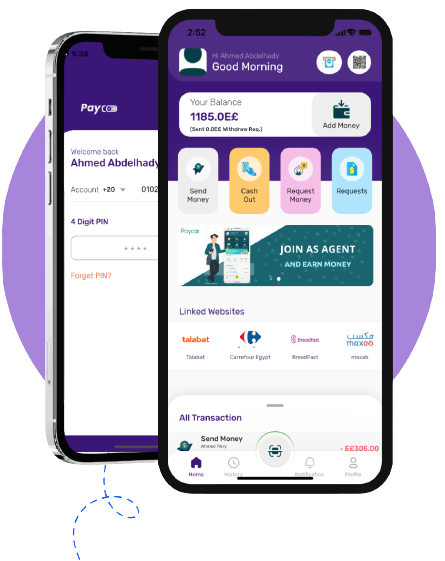

<a name="readme-top"></a>
<!-- PROJECT LOGO -->
<br />
<div align="center">
  <a href="https://paycoo.app">
    
  </a>

  <h3 align="center">Paycoo Payment Gateway Integration API</h3>
</div>


<!-- ABOUT THE PROJECT -->
## About The Project

<div align="center">
  <a href="https://paycoo.app">
    
  </a>
</div>

Paycoo offer a payment gateway that allows users to pay through their Paycoo wallet or any other linked wallet and enjoying discount percentages or points. Our payment portal is designed to work smoothly.
<p align="right">(<a href="#readme-top">back to top</a>)</p>

<!-- GETTING STARTED -->
## Process

To receive payment from customer as a merchant a user need to be registered as a merchant by Admin. Once admin registers and approves a merchant account then merchant can login to their panel. Merchant will get public key, secret key and merchant number from merchant panel in developers section.


## Payment Page Flow:

- A payment page will be appeared for customer.
- Customer will put their account number of ( payment gateway ) Paycoo
- Then proceed to OTP page


- After OTP verification customer will put their valid PIN number.
- If customer balance is sufficient then customer will be sent to the success page.

## Payment process from merchant website/shop:

### Make a Payment:

- First a payment order will be created in payment gateway server:
```sh
#Make payment

$url = 'BASE_URL/api/v1/create-payment-order';
$amount = 'YOUR_AMOUNT';

$response = Http::post($url, [
    'public_key'=> 'YOUR_PUBLIC_KEY',
    'secret_key'=> 'YOUR_SECRET_KEY',
    'merchant_number'=> 'MERCHANT_NUMBER',
    'amount'=> $amount,
])->json();


#Response

if($response['status'] == 'merchant_not_found'){
    //Merchant not found
}

if($response['status'] == 'payment_created'){
    return redirect()->away($response['redirect_url']. '&callback=' . $URL_YOU_WANT_TO_REDIRECT_AFTER_PAYMENT_DONE);
}

   ```
 
 
### Callback URL:

Merchant can set a callback url from shop settings, once customer completes the payment process, a transaction summary will be generated and sent to the given callback url.

```sh
https://PROJECT_URL/callback
   ```


### Verification URL:

Using transaction ID merchant website can verify payment for customer:

```sh
#Request

$transaction_id = 'GET_TRANSACTION_ID_FROM_REQUEST';
$payment_verification_url = 'https://paycoo.geeksy.tech/api/v1/payment-verification';

$response = Http::post($payment_verification_url, [
    'public_key'=> 'YOUR_PUBLIC_KEY',
    'secret_key'=> 'YOUR_SECRET_KEY',
    'merchant_number'=> 'MERCHANT_NUMBER',
    'transaction_id' => $transaction_id,
])->json();

#Success Response


{
  "payment_record": {
    "id": "6df7e156-69da-47d2-9d61-8464b4be0d42",
    "merchant_user_id": 66,
    "user_id": 57,
    "transaction_id": "Y37tR1674562943",
    "amount": 28,
    "callback": "https://paycoo.geeksy.tech/callback",
    "is_paid": 1,
    "expired_at": "2023-01-24T12:27:12.000000Z",
    "created_at": "2023-01-24T12:22:12.000000Z",
    "updated_at": "2023-01-24T12:22:27.000000Z"
  }
}

#Error Response

{
  "errors": [
    {
      "code": "error code",
      "message": "error message will be here"
    }
  ]
}

   ```
