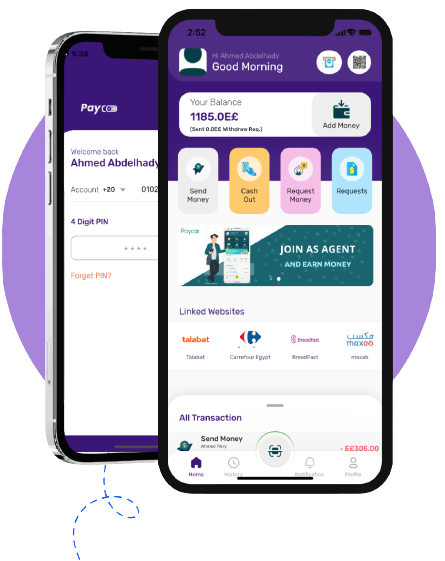

<a name="readme-top"></a>
<!-- PROJECT LOGO -->
<br />
<div align="center">
  <a href="https://paycoo.app">
    
  </a>

  <h3 align="center">Paycoo App</h3>

  <p align="center">
    Paycoo empowers you to make digital payments without the need for an internet connection!
    <br />
    <a href="https://github.com/ahmedabdel-hady/Paycoo-App/tree/main/Payment%20Gateway%20Integration"><strong>Explore Paycoo Payment Gateway »</strong></a>
    <br />
    <br />
    <a href="#dashboard-admin">Dashboard Demo</a>
    ·
    <a href="#">Downloud Android App</a>
  </p>
</div>


<!-- TABLE OF CONTENTS -->
<details>
  <summary>Table of Contents</summary>
  <ol>
    <li>
      <a href="#about-the-project">About The Project</a>
      <ul>
        <li><a href="#built-with">Built With</a></li>
      </ul>
    </li>
    <li>
      <a href="#prerequisites">Prerequisites</a>
      <ul>
        <li><a href="#basics">Basics</a></li>
        <li><a href="#server">Server</a></li>
        <li><a href="#mobile-app">Mobile app</a></li>
      </ul>
    </li>
    <li>
      <a href="#admin-panel">Admin Panel</a>
      <ul>
        <li><a href="#install-on-server">Install on server</a></li>
      </ul>
    </li>
    <li>
      <a href="#mobile-app">Mobile App</a>
      <ul>
        <li><a href="#app-build-&-release">App build & release</a></li>
      </ul>
    </li>   
    <li><a href="#demo-access">Demo Access</a></li>
    <li><a href="#contact">Contact</a></li>
  </ol>
</details>


<!-- ABOUT THE PROJECT -->
## About The Project

<div align="center">
  <a href="https://paycoo.app">
    
  </a>
</div>

Paycoo is a versatile digital payment solution that caters to the needs of various businesses, including traditional stores and E-commerce platforms. Our application provides businesses with a range of financial solutions, including a digital wallet that enables them to order goods from retailers and earn points, as well as a seamless way to obtain digital invoices and link to any other system.
For E-commerce platforms, we offer a payment gateway that allows users to pay through their Paycoo wallet or any other linked wallet while enjoying discount percentages or points. Our payment portal is designed to work smoothly and offers a way for users to pay even when they are not connected to the internet.
At Paycoo, we also prioritize the user's experience by providing them with unique features not offered by other wallets. Users can link all other digital wallets in one application, send and receive financial transfers at lower prices than competitors even offline, and enjoy digital payment solutions from any site through our Paycoo payment gateway without the need for a Visa or Mastercard. Furthermore, users can withdraw money from any ATM or traditional stores located anywhere.
Paycoo's innovative solutions and user-focused approach make it a leading player in the digital payment industry. We aim to provide businesses and individuals with a seamless, secure, and affordable payment experience that helps drive economic growth and financial inclusion.
<p align="right">(<a href="#readme-top">back to top</a>)</p>

### Built With

* [Flutter](https://flutter.dev/)
* [Firebase](https://firebase.google.com/)
* [PHP](https://www.php.net/)
* [laravel](https://laravel.com/)
* [Goolge Cloud](https://cloud.google.com/)
* [Tensorflow](https://www.tensorflow.org/)
* [MySQL](https://www.mysql.com/)

<p align="right">(<a href="#readme-top">back to top</a>)</p>


<!-- GETTING STARTED -->
## Prerequisites

### Basics:

Paycoo is a comprehensive system that offers numerous modules for mobile applications. Additionally, it includes a dashboard that serves as an administrative hub for managing the content and overseeing the processes of the mobile app.
- IDE for Mobile development, we preferred Android Studio and Xcode.
- Flutter SDK and JDK with path setup in your IDE.
- Real server Server related knowledge like apache or local machine server, we preferred to use a real server.
- Server related knowledge and we preferred cPanel in your server for quick installation.

### Server:

- Paycoo requires PHP v8.2 and MySQL 5.7+
- Mod_rewrite Apache
- BCMath PHP extension
- Ctype PHP, JSON, Mbstring, OpenSSL, PDO, Tokenizer, XML, Zip, Fileinfo, Gd, sodium Extension

### Mobile app:

- Android Studio
- Flutter SDK setup (version 3.3.7 Stable)
- JDK with path setup (only for vs code)
- Xcode for IPA file build


<!-- Admin Panel -->
## Admin Panel

### Install on server:

#### Admin Panel Installation:

Step 1: After download the code, upload the Dashboard-admin file in your server following your expected directory. paycoo admin panel can be installed on a domain or subdomain: For Example, yourdomain.com OR xyz.yourdomain.com.
      Note: Paycoo requires an SSL certificate to be installed on your domain to work with all the services. 
      
Step 2: Create a new database from your server MYSQL database, As create a DB user to the database and link that database to the DB user.

Step 3: Now you need to edit the  Database host, Database name, Database username, Database password, App Url to the .env file

        

Step 4: go to the database again, and upload the our DB.sql file on it form import section in DB.


<!-- Mobile App -->
## Mobile App

### App build & releaser:
 - Don't forget to Setup the Mobile App Environment (Flutter).

#### Build for Android:

- For debug build you can run command:
```sh
flutter build apk
   ```
- You will get a larger merged apk with this. But you can split them with this command:
```sh
flutter build apk --target-platform android-arm,android-arm64,android-x64 --split-per-abi
```
- Build file location: ``` <project>/build/app/outputs/flutter-apk/ ```
      

#### Build for IOS:

There are no general way to generate app for iOS. Apple doesn’t allow to install app like this debug way. If you want to install it on your iOS device then you have to deploy it on TestFlight or AppStore. For deploying it please follow this documentation: ``` https://docs.flutter.dev/deployment/ios ```
- But you can test it on XCode simulator


<!-- Demo Test -->
## Demo Access

### Dashboard Admin

- Go to [https://paycoo.geeksy.tech/](https://paycoo.geeksy.tech/)     
  ```
  Phone Number:"+201021192842"
  Password:"12345678" 
  ```

### Mobile App

- Downloud Paycoo App.apk    
  ```
  Phone Number:"+201021192842"
  PIN:"2451" 
  ```
  
### Merchent Dashboard

- Go to [https://paycoo.geeksy.tech/merchant/](https://paycoo.geeksy.tech/merchant/)     
  ```
  Country Code: "+20"
  Phone Number:"1112161029"
  Password:"12345678" 
  ```
<p align="right">(<a href="#readme-top">back to top</a>)</p>

<!-- CONTACT -->
## Contact

Project Link: [https://paycoo.app/](https://paycoo.app/)

<p align="right">(<a href="#readme-top">back to top</a>)</p>
